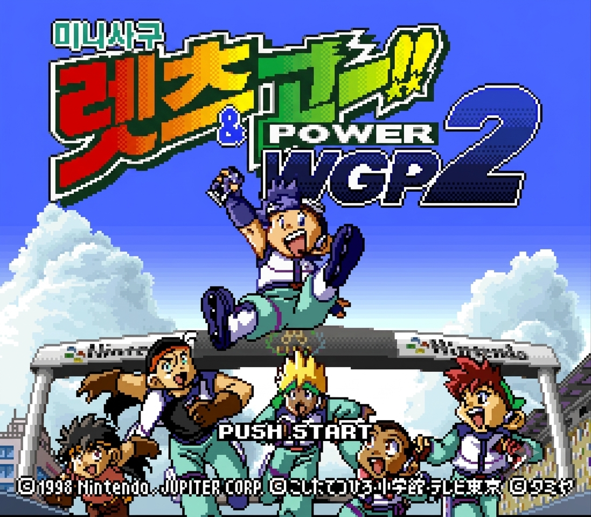

<p align="center">
  
  <br>
  <sub>타이틀 화면 (SFC 네이티브 256×224, 2× 표시)</sub>
</p>

# ミニ四駆 レッツ&ゴー!! POWER WGP2 — 한글 패치 프로젝트

SNES(Super Famicom) 게임 **「ミニ四駆 レッツ&ゴー!! POWER WGP2」**(미니욘쿠 렛츠&고!! 파워 WGP2)의
한글 팬 번역 패치 프로젝트. 레트로 게임 한글화 파이프라인(ROM 분석 → 역공학 → 폰트 → 추출·번역 → 재삽입 → 빌드)을 따른다.

> ⚠️ **법적 고지**: 이 저장소에는 **원본 ROM이 포함되지 않는다.** 도구·역공학 문서·번역 데이터만 둔다.
> 배포는 **xdelta/BPS 차분 패치**(원본 소지자가 직접 적용)로만 이뤄진다. 원본 ROM은 각자 합법적으로 확보할 것.

## 대상 ROM

| 항목 | 값 |
|------|-----|
| 매퍼 | HiROM + FastROM (헤더리스 2MB) |
| CRC32 / MD5 | `4459D4D0` / `acdeb2ee6ef7b460c5dfed6957f8581a` |
| HiROM 주소 변환 | `PC = ((bank & 0x3F) << 16) \| addr` |

## v0.9 배포

- [GitHub Release v0.9](https://github.com/namyunho/mini-yonku-wgp2-kr/releases/tag/v0.9)
- [v0.9 패치 적용법·작업 내용·축약 조정 통계](release/v0.9/README.md)
- 배포 파일은 `wgp2_kr_v0.9.xdelta`이며 원본 ROM과 패치 적용 ROM은 포함하지 않는다.

## 진행 상태

| 단계 | 상태 |
|------|------|
| 매체 식별·무결성 | ✅ 완료 (HiROM 확정) |
| 텍스트 위치·인코딩 역공학 | ✅ 완료 (파서 `$C1:9554`, 1바이트 가변길이, 글리프=byte−0x10) |
| 폰트 경로 | ✅ 완료 (본문 폰트 뱅크 `$CA`, 16×16 1bpp VWF 비압축) |
| PoC (한글 화면 표시) | ✅ 통과 (실기 Mesen2 렌더 확인) |
| **정적 대사 681** 추출·번역·재삽입 | ✅ 완료 (681/681 무손실, `build_patch.py` — 포메이션 안내 `$C1:CFAF` + 세팅 프리셋·평가문 등 `$C1:C501` 테이블 미캡처 고아 문자열 8건 발굴 복구 포함) |
| **어드벤처 스토리 엔진** 역공학 | ✅ 완료 (씬 VM·압축 코덱·씬표 `$C6:9C57` — [docs/08](docs/08-adventure-text-engine.md)) |
| **어드벤처 스토리 번역·재삽입** | ✅ **완료** — 엄격 VM 재감사로 분기·목록 뒤 숨은 대사 58개를 복구해 **235씬·1,782메시지 전량 반영**. 위치보존 크래시 원천차단(런 단위 패딩 → 디컴프 스크립트 길이·VM offset 불변, [docs/14](docs/14-position-preserving-translation.md)). cmd0x20은 2바이트 오퍼랜드를 보존하고 본문만 같은 길이로 치환. 오프닝~엔딩 전편 실기 완주, 크래시 0 확인 |
| **월드맵 퀴즈·정보 DB** | ✅ 70문항·350문자열 추출/번역/재삽입 완료 (`$C6:A08D` 포인터표, 350/350 왕복·역디코드 — [docs/19](docs/19-worldmap-quiz-text.md)) |
| **장소별 필드/NPC 숨은 레코드** | ✅ 전수 발굴·번역·**위치보존 재삽입 완료** (**1,207레코드**, C2 참조 1,290개+패턴 오탐 10개 제외, 텍스트런 1,411/고유 **1,340 전량 번역**; 텍스트 레코드 685개 역검증·타일/OBJ 실기 정상, [docs/20](docs/20-field-npc-hidden-records.md)·[docs/21](docs/21-field-position-preserving-translation.md)) |
| **그래픽 한글화**(타이틀·일시정지·Result·포메이션·능력치·개러지·경기 HUD·챕터 인트로·에피소드 인터미션·엔딩 크레딧) | ✅ 통합·실기 QA 완료 (LZSS·스프라이트·타일맵 재삽입, [docs/10](docs/10-graphics-assets.md)·[docs/24](docs/24-ending-credits-analysis.md)) |
| **시작 저장메뉴**(SJIS) | ✅ 완료 (처음부터/이어하기/복사/삭제, `build_menu.py`) |
| **SJIS 메뉴/UI 텍스트**(레이서명·팀명·머신/파츠명·행성·옵션부품·시작/저장메뉴) | ✅ **완료** (비압축 SJIS 한글화 + 슬롯 `0x86` 확장 189→224, `build_sjis.py`) |
| **소형 타일폰트 메뉴**(월드맵 X메뉴·조작방법 튜토리얼·용어집·지도·이지·수동 세팅 X메뉴·확인 대화문·다음 LV — System④) | ✅ **완료** — 원본 소형폰트 자원(`$D9`)을 문맥별 한글 글꼴로 재압축·포인터 리다이렉트(코드 훅/NMI 없음). 이지·수동 세팅은 교체된 원문 가나 타일만 회수하며 영문·숫자는 원본 보존(`build_setbox.py`) |
| 인게임 QA·차분 패치 배포 | ✅ **v0.9 xdelta 배포 완료** (메인스토리 **오프닝~엔딩 전편 실기 완주·크래시 0**, 대표 필드/NPC·승인 그래픽 확인, xdelta 역적용 바이트 일치) |

> **번역 현황 요약**: 정적 대사·어드벤처 스토리(오프닝~엔딩 전편)·월드맵 퀴즈/정보 DB·**장소별 필드/NPC 대사 1,340종**·비압축 **SJIS 메뉴/UI**·**소형 타일폰트 메뉴**·지정 그래픽과 **실제 엔딩 크레딧·베스트타임**의 번역·통합 재삽입과 실기 QA가 완료됐다. Result는 선수 ID 범위표 110개·표시 이름 61종을 반영했으며 물리 타일 공유가 없음을 검증했다.

통합 빌드는 번역 카탈로그와 실제 치환 항목을 대조한다. 어드벤처 미반영 항목, 정적 대사 미커버 초과,
필드 위치보존 상한 초과가 하나라도 생기면 ROM 생성을 실패시켜 번역문이 조용히 원문으로 되돌아가지 않게 한다.

### 완료 블록

| 시스템 | 규모 | 내용 |
|------|------|------|
| 정적 대사 681 | `c7_race` 232 · `d0_story` 404 · `c1_ui` 45 | 레이스 중계·스토리/배틀 서사·세팅/개러지/포메이션 UI(세팅 프리셋·완성도 평가문 포함) |
| 어드벤처 스토리 | **번역 씬 235 / 메시지 1,782** | 오프닝·각국팀 대진·세이바가 일상·인격교환·후일담·백과사전 등 전 스토리. 원본 카탈로그 1,798런 중 VM 기능바이트로 확인된 cmd0x20 16런은 비번역 보존 |
| 월드맵 퀴즈·정보 | **70문항 / 350문자열** | 산수 40문항 + 정보 30문항, 질문 1 + 선택지 4 구조 보존 |
| 장소별 필드/NPC | **텍스트런 1,411 / 고유 1,340** | `text_kr_full` 완역본과 `text_kr` 삽입본(축약 280) 분리 보존, 685개 압축 레코드 재삽입·위치/렌더 역검증 통과 |
| Result 선수명 | **선수 ID 110 / 표시 이름 61종** | `$D9:1DDC` 아틀라스와 `$C1:CBAF` 범위표 재삽입, 물리 타일 공유 0개 검증 |
| 그래픽 | 타이틀 화면·경기 일시정지·포메이션·능력치·개러지 분류·경기장명·챕터 인트로 10종·경기 HUD·VICTORYS 에피소드 인터미션 | 타일/스프라이트/타일맵 재삽입 |
| 실제 엔딩 | **크레딧·베스트타임 45행 + 현지화 메시지 12행** | 엔딩 전용 8×8 글꼴과 C7 명령열 재배치, 런타임 기록 필드 보존 |
| SJIS UI(전체) | 레이서 57·팀 10·머신 22·행성 11·옵션 15 + 시작/저장메뉴 | 비압축 SJIS 한글화 + 슬롯 **0x86 확장(189→224)** — [docs/12](docs/12-sjis-ui-hangul.md) |
| 소형 타일폰트 메뉴(System④) | 월드맵 X메뉴·조작방법 튜토리얼·용어집·지도·수동 세팅 X메뉴·확인 대화문·`다음LV까지` | 원본 `$D9` 소형폰트를 문맥별 한글 글꼴로 재압축·포인터 리다이렉트(코드 훅/NMI 없음) |

### 완료 판정과 유지보수

v0.9에서 선언한 번역·재삽입·그래픽·실기 QA·차분 패치 배포 범위는 모두 완료됐으며,
현재 계획된 남은 작업은 없다. 이후 발견되는 오탈자·표시 이상·호환성 제보는 미완료 작업이
아니라 배포 후 유지보수 이슈로 처리한다.

## 저장소 구조

```
assets/
  fonts/
    body/            16×16 본문 폰트
    small/           8×8 메뉴·엔딩 폰트
  graphics/          화면별 승인 그래픽·작업 템플릿
    result/          경기 결과의 코스명·선수명
    title_credits/   타이틀·크레딧 원본/번역 이미지
  screenshots/readme/ README 표시용 스크린샷
  translations/     dialogue.json(681) · adventure_kr.json · worldmap_{kr,text}.json · field_text.json
  translation_guide/ glossary.md(용어집) · glyph_table.tsv(글리프표)
docs/
  history/          폐기 설계·하위 브랜치 병합 전 역사 기록
  worklogs/         당시 작업 브리핑·인계·시행착오
  01-24*.md         현재 구현 명세·감사 문서
scripts/
  *.py              Python 분석·추출·디코드·빌드 도구(build_all.py 통합)
  lua/
    capture/         Mesen2 덤프·스크린샷 수집
    probes/          단발성 API·화면 상태 조사
    traces/          실행·DMA·소스 주소 추적
src/         Rust 파이프라인(kr-patch-wgp2 크레이트)
roms/ out/ tmp/   비커밋 (원본 ROM·산출물·임시 파일)
```

세부 역할과 새 파일 배치 기준은
[`assets/README.md`](assets/README.md), [`scripts/README.md`](scripts/README.md),
[`docs/README.md`](docs/README.md)를 따른다.

## 문서 (정본)

문서 01–24의 역할과 최신 정본·역사 기록·자동 생성 감사의 관계는
**[docs 문서 지도](docs/README.md)**에서 관리한다. 특히 초기 추출(06)과 현재 완전성(07),
원복 사건(13)과 위치보존 구현(14), 축약 정책(15)과 959건 전수 비교(22),
퀴즈 구현(19)과 문항 감사(23)를 구분해 읽어야 한다.

## 번역 용어집 (고유명사·용어 통일)

번역 시 인명·마신명·팀명·UI 용어·**캐릭터 말투**를 일관 적용하기 위한 정본 → **[assets/translation_guide/glossary.md](assets/translation_guide/glossary.md)**

- **명명 정책**: 1차 = **일본 원어 음차**(세이바 고 등). 한국 방영판(「우리는 챔피언」) 로컬명은 병기·학습만, 차후 별도 "한국명 버전"용. MAX(3기)·Return Racers 계열은 이 게임 범위 밖 → 미사용.
- **호칭 규칙**: 원문이 이름만 부르는 호격(`ゴー！`)은 성을 붙이지 않고 형태 유지 → 「고!」(❌「세이바 고!」).
- **말투 가이드(§1.5)**: 츠치야「이 아이」↔오오가미「머신」, 토우키치 `~옵쇼`, 지로마루 충청 `~유`, 텟신 사극풍, 카를로 빈정, 파이터 하이텐션 등 어미로 화자 식별.
- **WGP 10개국 대표팀** 로스터·에이스 머신, **UI 용어**·경기장명, 어드벤처 조연·단역 표기 수록.

## 빌드·검증

```bash
git clone https://github.com/namyunho/mini-yonku-wgp2-kr.git
cd mini-yonku-wgp2-kr
# ⚠️ 빌드에 필요하나 gitignore된 본문 폰트 .bin과 원본 ROM은 별도 배치 필요.

# ROM 무결성:
cargo run -- info --rom "roms/Mini Yonku Let's & Go!! - Power WGP 2 (J) (NP).smc"

# 통합 빌드(원본과 동일한 2MB → out/wgp2_kr.smc + out/wgp2_kr.bps):
python3 scripts/build_all.py

# 추출·카탈로그 회귀:
python3 scripts/extract_worldmap_text.py  # 월드맵 350/350 왕복
python3 scripts/extract_field_text.py     # 필드/NPC 1,207레코드·C2 참조 1,290개(+오탐 10개 제외)

# 재삽입·검증:
python3 scripts/build_patch.py --adv-json assets/translations/adventure_kr.json --worldmap-json assets/translations/worldmap_text.json --field-json assets/translations/field_kr.json --out out/wgp2_kr.smc
python3 scripts/build_adv.py         # 어드벤처 재삽입 역검증(round-trip·렌더일치)
python3 scripts/build_field.py       # 필드/NPC 위치보존 재삽입·685/685 역검증
python3 scripts/validate_field_translation.py
python3 scripts/audit_field_position.py
python3 scripts/test_roundtrip.py    # 정적 대사 681/681 무손실
```

**도구 체인**:
- **Python 3** — 주 파이프라인(`scripts/`, 표준 라이브러리 + Pillow): 추출·디코드·재삽입·빌드.
- **Rust**(kr-patch-wgp2) — ROM 정보/무결성.
- **역공학**: **IDA Pro 9.4**(`ida-pro-mcp` GUI 브리지 + `idalib-mcp` 헤드리스) · **Ghidra 12.1.2**(GhidraMCP, 디컴파일 크로스체크) · **asar 1.91**(65816 어셈블러, ASM 훅·패치) — 셋업 [docs/16](docs/16-reverse-engineering-mcp.md).
- **Mesen2**(arm64 macOS/Windows) — Lua 스크립팅 QA·트레이싱.
- **xdelta3** — v0.9 xdelta 차분 생성·역적용 검증.
- **Flips** — BPS 차분 배포(선택, 통합 빌드가 감지 시 자동 생성).
- **OPTPiX ImageStudio** — 색상 보존 감색, 색상 팔레트 관리.

## 기여·에이전트 협업

착수 전 **[CLAUDE.md](CLAUDE.md)** 또는 **[AGENTS.md](AGENTS.md)**(Codex 등)를 먼저 읽을 것.
핵심 불변식: **원본 ROM 비커밋 · 라운드트립 우선 · HiROM 변환 공식 하나만 사용.**

- **어드벤처 번역**은 서사 클러스터 단위로 나눠 Claude+Codex 두 AI가 분담, 4중 게이트(마커·줄수·전각공백·줄폭≤16)로 교차 검수하는 방식으로 진행됐다.
- **결합(coupling) 주의**: 어드벤처 음절이 늘면 폰트시트 `$CA` 공유로 정적 대사 681개 중 일부가 슬롯을 초과할 수 있다. `build_patch`가 초과 id를 출력하면 해당 대사를 최소 범위로 조정하고 완역과 삽입문을 분리 보존한다.
- **문장부호**는 전각만 사용(`！？〜…。「」『』・`). 반각 `! ? ~ , . ; :` 는 게임 폰트에 없다.

## 라이선스

- 도구·문서·번역 데이터: 저장소 소유자 귀속.
- 한글 폰트: `assets/fonts/README.md`의 귀속·라이선스(SIL OFL 1.1) 참조.
- 원본 게임의 모든 권리는 저작권자(TAKARA/AKG 등)에 있다. 본 프로젝트는 비영리 팬 번역이다.
